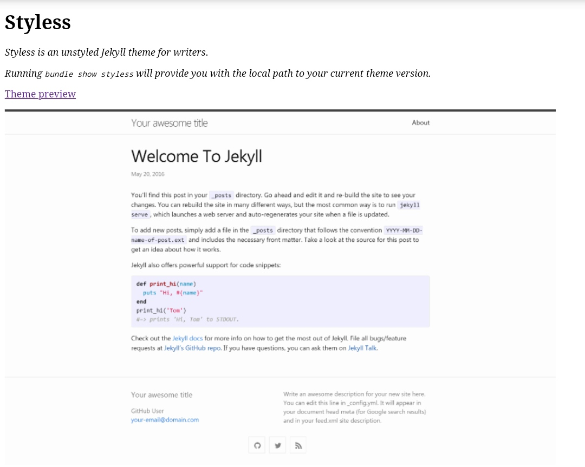
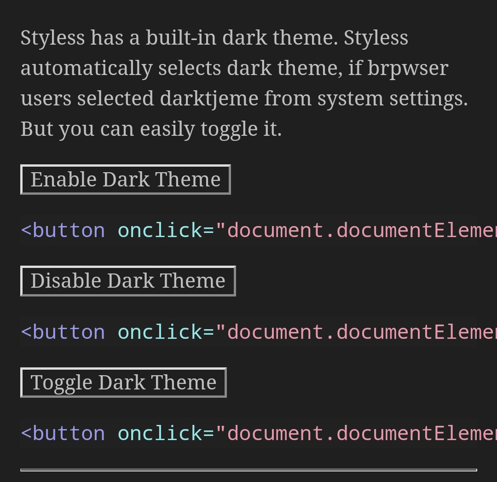

<p align="center">
    <h1 align="center">Styless</h1>
    <p align="center">A modern, highly customizable, and unstyled Jekyll theme for developers with built-in dark mode.<br>Easily hosted on GitHub Pages with few dependencies.</p>
    <p align="center"><strong><a target="_blank" href="https://moonharelabs.github.io/styless">See it in action!</a></strong></p>
    <br><br><br>
</p>

|||
|-|-|

## Getting started
### Dependencies
Styless is built for [Jekyll](https://jekyllrb.com/), a static site generator. View the [quick start guide](https://jekyllrb.com/) for more information. Styless requires no special plugins and can run on GitHub Pages’ standard Jekyll compiler. The [Jekyll SEO Tag plugin](https://github.com/jekyll/jekyll-seo-tag) is included by default (no need to run any special installation) to inject SEO and open graph metadata on docs pages. For information on how to configure SEO and open graph metadata visit the [Jekyll SEO Tag usage guide](https://jekyll.github.io/jekyll-seo-tag/usage/).

### Quick start: Use as a GitHub Pages remote theme

1. Add Styless to your Jekyll site's `_config.yml` as a [remote theme](https://blog.github.com/2017-11-29-use-any-theme-with-github-pages/)
```yaml
remote_theme: moonharelabs/styless
```
<small>You must have GitHub Pages enabled on your repo, one or more Markdown files, and a `_config.yml` file. [See an example repository](https://github.com/moonharelabs/styless/tree/main/docs)</small>


### Local installation: Use the gem-based theme

1. Install the Ruby Gem
```bash
$ gem install styless
```
```yaml
# .. or add it to your your Jekyll site’s Gemfile
gem "styless"
```
2. Add Styless to your Jekyll site’s `_config.yml`
```yaml
theme: "styless"
```
3. Run you local Jekyll server
```bash
$ jekyll serve
```
```bash
# .. or if you're using a Gemfile (bundler)
$ bundle exec jekyll serve
```
4. Point your web browser to [http://localhost:4000](http://localhost:4000)

If you're hosting your site on GitHub Pages, [set up GitHub Pages and Jekyll locally](https://help.github.com/en/articles/setting-up-your-github-pages-site-locally-with-jekyll) so that you can more easily work in your development environment.

### Configure Styless

- [See configuration options](configuration)

---

## About the project

Styless is &copy; 2021-{{ "now" | date: "%Y" }} by @ksengine.

### License

Styless is distributed by an [Unlicense License](https://github.com/moonharelabs/styless/tree/main/LICENSE).

### Contributing

When contributing to this repository, please first discuss the change you wish to make via issue,
email, or any other method with the owners of this repository before making a change. Read more about becoming a contributor in [our GitHub repo](https://github.com/moonharelabs/styless#contributing).

### Code of Conduct

Styless is committed to fostering a welcoming community.

[View our Code of Conduct](https://github.com/moonharelabs/styless/tree/main/CODE_OF_CONDUCT.md) on our GitHub repository.
